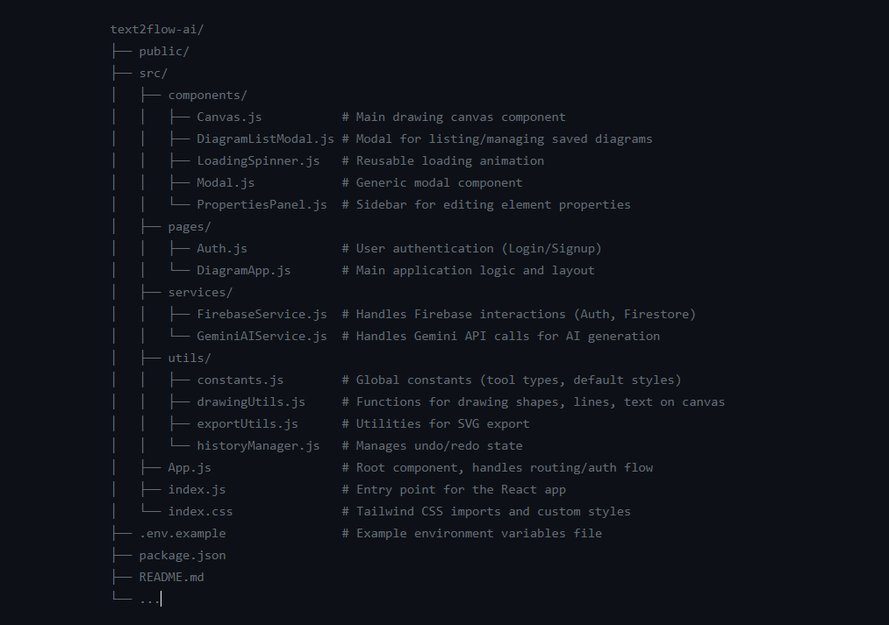

# Text2Flow AI: Diagramming with Intelligence 🚀


Text2Flow AI is an innovative web application that revolutionizes diagram creation by leveraging the power of Artificial Intelligence. Simply describe the diagram you want to create in natural language, and Text2Flow AI will generate it for you. Beyond AI generation, it offers a full suite of manual drawing tools, intelligent refinement capabilities, and robust save/load/export features, making diagramming intuitive and efficient.

## ✨ Features

* **🧠 AI-Powered Diagram Generation:** Describe your desired flowchart, mind map, or other diagram type using a text prompt, and watch AI bring it to life on the canvas.
* **💡 AI-Assisted Element Refinement:** Select existing elements and use natural language to modify their properties (e.g., "change this rectangle to an oval and make it green").
* **✍️ Intuitive Drawing Tools:** Create diagrams from scratch with a comprehensive set of manual tools:
    * **Select:** Choose, move, resize single or multiple elements. Supports group selection via drag box.
    * **Rectangle, Oval, Diamond:** Standard shapes for flowcharts and other diagrams.
    * **Line:** Draw connectors between elements, with intelligent snapping to shape boundaries.
    * **Text:** Add labels and annotations anywhere on the canvas or directly within shapes.
* **↩️ Undo/Redo History:** Effortlessly revert or reapply changes with a robust history management system.
* **💾 Cloud Storage (Firebase):** Save your diagrams securely to the cloud and load them anytime, from any device.
* **🖼️ High-Resolution Export:** Export your diagrams as:
    * **PNG:** High-quality image format for sharing.
    * **SVG:** Scalable Vector Graphics for crisp, resolution-independent use.
* **📱 Fully Responsive Design:** Enjoy a seamless experience across all devices, from desktop browsers to mobile phones.
* **🔐 User Authentication:** Securely manage your diagrams with anonymous or email/password authentication.

## 🚀 Technologies Used

* **Frontend:**
    * [React](https://react.dev/) - A JavaScript library for building user interfaces.
    * [Tailwind CSS](https://tailwindcss.com/) - A utility-first CSS framework for rapid UI development.
    * [HTML Canvas API](https://developer.mozilla.org/en-US/docs/Web/API/Canvas_API) - For dynamic, interactive drawing.
    * [Lucide React](https://lucide.dev/icons/) - Beautiful and customizable open-source icons.
* **AI Integration:**
    * [Google Gemini API](https://ai.google.dev/models/gemini) - For powerful text-to-diagram generation and refinement.
* **Backend/Database:**
    * [Firebase Authentication](https://firebase.google.com/docs/auth) - For user management (anonymous and email/password).
    * [Firebase Firestore](https://firebase.google.com/docs/firestore) - A NoSQL cloud database for storing diagram data.

## 🏁 Getting Started

Follow these steps to set up and run Text2Flow AI on your local machine.

### Prerequisites

* Node.js (LTS version recommended)
* npm (Node Package Manager)

### Installation

1.  **Clone the repository:**
    ```bash
    git clone https://github.com/HarshitRai121/text2flow-ai.git
    cd text2flow-ai
    ```
2.  **Install dependencies:**
    ```bash
    npm install
    ```
    
### Firebase Setup

Text2Flow AI uses Firebase for authentication and data storage. You'll need to set up your own Firebase project:

1.  Go to the [Firebase Console](https://console.firebase.google.com/) and create a new project.
2.  **Enable Services:**
    * **Authentication:** Go to "Build" > "Authentication" > "Get started". Enable "Email/Password" and "Anonymous" providers.
    * **Firestore Database:** Go to "Build" > "Firestore Database" > "Create database". Choose "Start in production mode".
3.  **Get Firebase Configuration:**
    * In your Firebase project settings (Project overview -> Project settings icon -> Project settings), scroll down to "Your apps" and add a new web app (`</>`).
    * Copy the Firebase configuration object. It will look something like this:
        ```javascript
        const firebaseConfig = {
          apiKey: "YOUR_API_KEY",
          authDomain: "YOUR_AUTH_DOMAIN",
          projectId: "YOUR_PROJECT_ID",
          storageBucket: "YOUR_STORAGE_BUCKET",
          messagingSenderId: "YOUR_MESSAGING_SENDER_ID",
          appId: "YOUR_APP_ID"
        };
        ```
4.  **Environment Variables (Firebase):**
    * Create a `.env` file in the root directory of your project (where `package.json` is located).
    * Add your Firebase configuration variables to this file, prefixed with `REACT_APP_`:
        ```dotenv
        REACT_APP_FIREBASE_API_KEY="YOUR_API_KEY"
        REACT_APP_FIREBASE_AUTH_DOMAIN="YOUR_AUTH_DOMAIN"
        REACT_APP_FIREBASE_PROJECT_ID="YOUR_PROJECT_ID"
        REACT_APP_FIREBASE_STORAGE_BUCKET="YOUR_STORAGE_BUCKET"
        REACT_APP_FIREBASE_MESSAGING_SENDER_ID="YOUR_MESSAGING_SENDER_ID"
        REACT_APP_FIREBASE_APP_ID="YOUR_APP_ID"
        ```
    * **Important:** The `__app_id`, `__firebase_config`, and `__initial_auth_token` variables are automatically provided by the Canvas environment and *do not* need to be added to your `.env` file for local development. Your application code already handles checking for `typeof __app_id !== 'undefined'` to use these global variables when deployed in Canvas.

5.  **Firestore Security Rules:**
    * In the Firebase Console, navigate to "Build" > "Firestore Database" > "Rules".
    * **Set up rules to control data access.** For this application, you will want rules that:
        * Allow **authenticated users** to read and write data.
        * Ensure users can only **read/write their own private data**.
        * Allow authenticated users to read/write to a designated **public collection** for shared application data (e.g., `/artifacts/{appId}/public/data/{collectionName}`).
    * A common pattern for private user data is: `match /artifacts/{appId}/users/{userId}/{documents=**} { allow read, write: if request.auth != null && request.auth.uid == userId; }`
    * A common pattern for public app data is: `match /artifacts/{appId}/public/data/{documents=**} { allow read, write: if request.auth != null; }`
    * Refer to the [Firebase Firestore Security Rules documentation](https://firebase.google.com/docs/firestore/security/get-started) for detailed syntax and best practices.
    * Click "Publish" after setting your rules.

### AI API Setup (Google Gemini)

To use the AI generation and refinement features, you need a Google Gemini API key:

1.  Go to the [Google AI Studio](https://aistudio.google.com/app/apikey) and generate an API key.
2.  **Add to Environment Variables:**
    * In your `.env` file (created in the Firebase setup step), add your Gemini API key:
        ```dotenv
        REACT_APP_GEMINI_API_KEY="YOUR_GEMINI_API_KEY"
        ```
    * **Note:** The application code will use this environment variable to make API calls to Gemini.

### Running the Application

1.  **Start the development server:**
    ```bash
    npm start
    ```
2.  Open your browser and navigate to `http://localhost:3000`.

## 💡 Usage

### AI Diagram Generation
1.  Enter a detailed description of your desired diagram in the "Describe your diagram" text area.
2.  Click "Generate Diagram with AI".
3.  The AI will process your request and draw the diagram on the canvas.

### AI Refinement
1.  Select an element on the canvas (click on it).
2.  Enter a refinement prompt in the "AI Refinement" text area (e.g., "change this to a green oval", "add label 'Decision Point'").
3.  Click "Refine Selected with AI".

### Manual Drawing
1.  Select a tool from the "Tools" sidebar (e.g., Rectangle, Oval, Line).
2.  Click and drag on the canvas to draw your element.
3.  Use the "Select" tool to move, resize (shapes), or multi-select elements.
    * **Multi-select:** Drag a selection box over multiple elements, or hold `Shift` and click multiple elements.
    * **Pan Canvas:** With the "Select" tool active, hold `Alt` (or `Option`) and drag on empty canvas space.

### Saving and Loading
1.  Click "Save" to save your current diagram. You'll be prompted to enter a name.
2.  Click "Load" to open a modal showing your saved diagrams. Select one to load or delete.

### Exporting
1.  Click "Export PNG" to download your diagram as a high-resolution PNG image.
2.  Click "Export SVG" to download your diagram as a scalable vector graphic.

## 📂 Project Structure

                                                                       

## 🚀 Future Enhancements

* **More Diagram Types:** Expand AI generation and manual tools for UML diagrams, network diagrams, etc.
* **Customizable Styles:** Allow users to define and save custom color palettes and element styles.
* **Collaboration Features:** Enable multiple users to work on the same diagram in real-time.
* **Advanced AI Interactions:** More nuanced AI refinement, auto-layout, and smart suggestions.
* **Image/Icon Import:** Allow users to upload and embed images or icons.
* **Context Menus:** Right-click menus for quick actions on elements.

## 🤝 Contributing

Contributions are welcome! If you have suggestions, bug reports, or want to contribute code, please feel free to open an issue or submit a pull request.